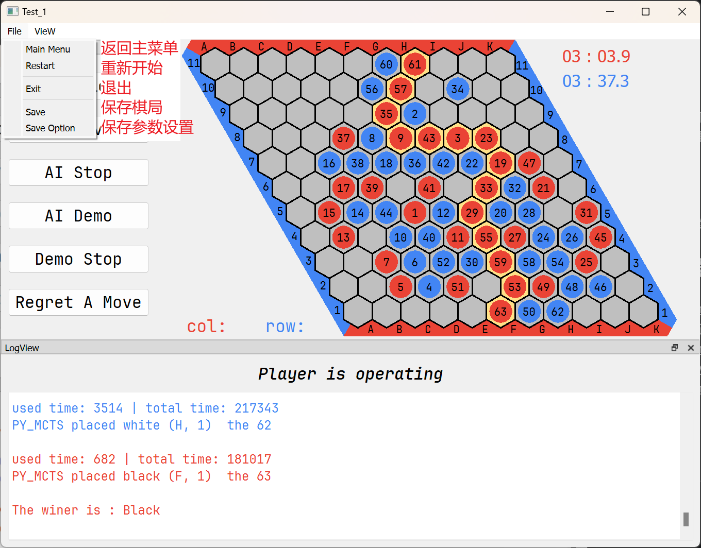

# 说明

## ./HexUI

HexUI 文件夹下是未完成设计的游戏交互界面，后期觉得没有太大必要弄花里胡哨的，就搁置废弃了。

可见 [ui png](#ui-png)

## ./Test_1

此文件夹下是软件本体

## 开源参考

- [./Test_1/mohex](./Test_1/mohex) 文件夹中是引用开源 `mohex2.0`:https://github.com/cgao3/benzene-vanilla-cmake 的部分代码，做了部分为了契合我自身模型所作的修改

- [./Test_1/py/battle](./Test_1/py/battle) python部分参考借鉴了开源代码 `azalea`: https://github.com/jseppanen/azalea ，同时使用的模型也是 `azalea`

# 软件环境

- Qt 6.5.3
- python 3.11

# 软件介绍

## 主菜单界面

可以设置棋盘阶数、模式，也可以设置每一个AI的具体参数，需要注意 `Py_Mcts` 仅支持 11 阶

ECF参数在其他AI中为蒙特卡洛树的 `UTC` 值的常量，在 `Py_Mcts` 中为 `80000*ecf` 次模拟

Time在其他AI中为一步的思考时间（秒），在 `Py_Mcts` 中为 一局的限制时间（分钟）

## 操作界面

左侧工具栏和底部日志栏默认为嵌入下棋界面，也可以拖动悬停

鼠标悬浮在格子上会有落子虚影和坐标显示

左上角的菜单如下功能

保存参数设置界面

# UI Png

